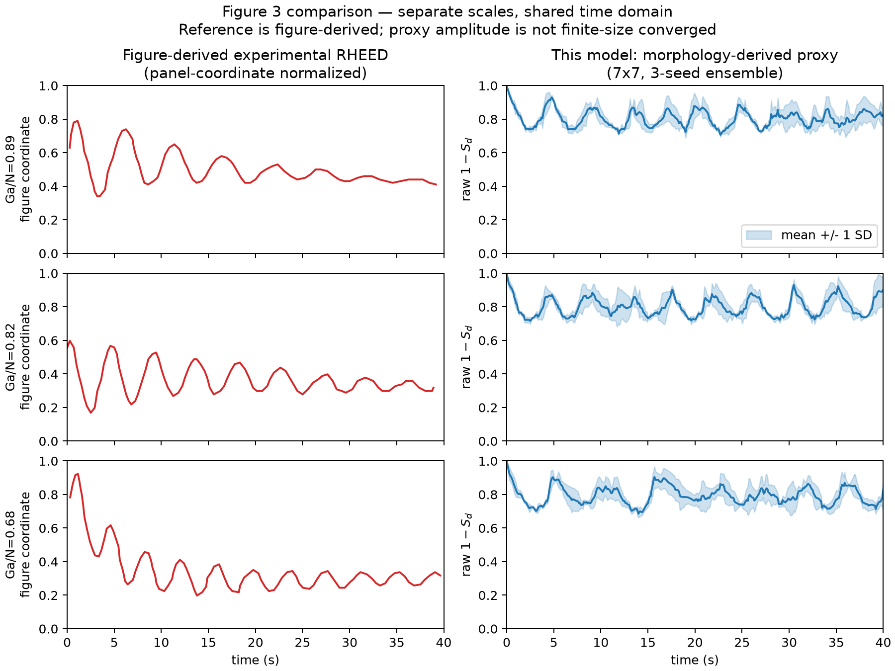
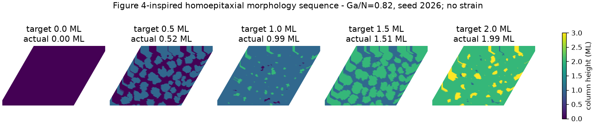
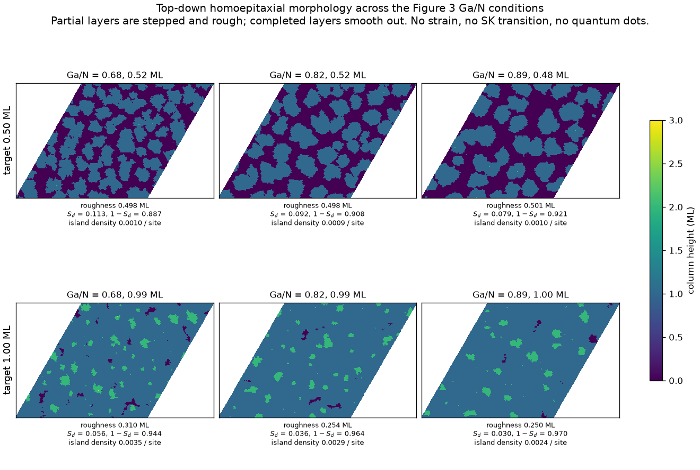
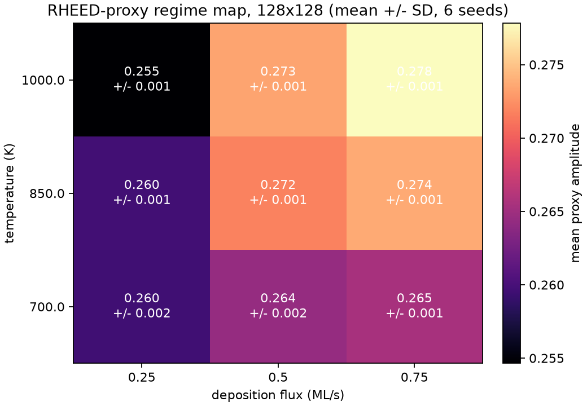
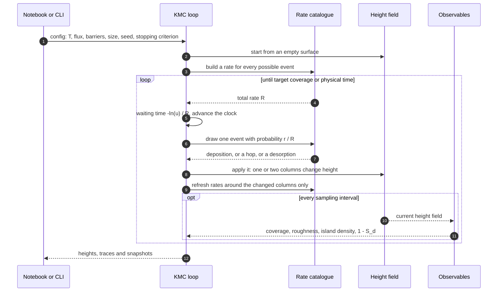
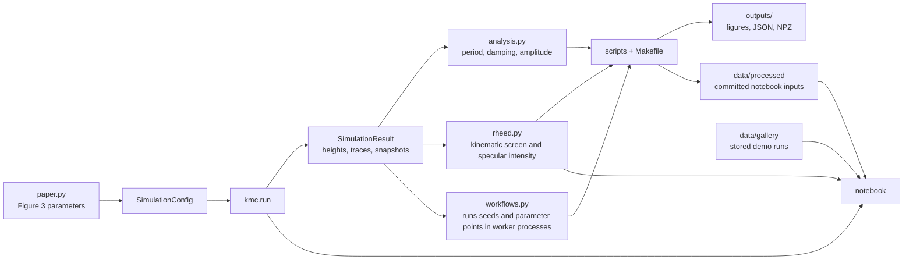

# MBE growth and RHEED oscillations

Kinetic Monte Carlo (KMC) simulation of molecular-beam-epitaxy growth. Deposition, thermally
activated surface diffusion, downward step barriers and desorption on a periodic solid-on-solid
lattice, with a step-density RHEED proxy plotted alongside the surface morphology.

The plotted RHEED signal is a step-density proxy, not a diffraction calculation; a separate
kinematic diffraction module computes the screen itself. Scope and known
limitations: [`STATUS.md`](STATUS.md). Source paper: `nanomaterials-12-03052.pdf` (CC BY).
MIT licensed, except the paper and the three Wikimedia schematics: [`LICENSE`](LICENSE).

## Results so far

Work in progress; the open items are listed in [`STATUS.md`](STATUS.md). The figures below and
the stored notebook demos are all generated on a 128x128 lattice, the largest size the
finite-size study covers.

Oscillations against the paper's Figure 3, for three Ga/N ratios. Left is digitized from the
published figure, right is a five-seed 128x128 ensemble of this model. The model oscillates at
0.94 to 0.96 ML in all three conditions, against 1.05 ML for the digitized Ga/N = 0.82 trace;
the other two reference periods are less well defined. The proxy amplitude stays six to eight
times smaller than the figure-derived signal, which is why the two panels keep separate scales
(`make figure3`).



The surface behind those oscillations, 0 to 2 ML of homoepitaxial growth. Each layer fills before
the next nucleates, which is what makes the proxy oscillate (`make figure3`).



The same surfaces seen across all three Ga/N conditions at the two points that define the
oscillation: a half-filled layer and a closed one. Rows are coverage, columns are Ga/N, and
every panel comes from the ensemble the comparison above already ran, so the figure costs no
extra simulation (`make figure3`).



At 0.50 ML the surface is islanded and `S_d` peaks; at 1.00 ML the layer has closed and `S_d`
drops by roughly half, which is the whole of why the proxy oscillates. Across the columns the
trend is monotonic in both rows: raising Ga/N from 0.68 to 0.89 lowers `S_d` from 0.113 to 0.079
at half coverage and from 0.056 to 0.030 at layer completion, so the richer Ga conditions sit
closer to ideal layer-by-layer filling. This is homoepitaxial GaN throughout - no strain, no
Stranski-Krastanov transition and no quantum dots are modelled or claimed.

Proxy amplitude against temperature and flux, 128x128, six seeds per point. Higher flux raises
the plotted raw amplitude at every temperature, while the temperature trend is weaker and not
monotonic at the lowest flux. The detrended amplitude, which is the principal observable in the
stored JSON, does rise with both: 0.088 to 0.099 from the coldest/slowest to the hottest/fastest
corner, with a seed spread under 0.0011. None of the nine conditions passes the oscillation test
at this lattice size, which is the same finding as the island-growth demo (`make sweep`).



The notebook adds the interactive versions: a rotatable surface, playback over the recorded
frames, and a frame slider tied to the RHEED trace. `make export` writes the whole thing to
`outputs/mbe_rheed.html`.

## How it works

### Why kinetic Monte Carlo

RHEED oscillations are a kinetic effect, not an equilibrium one: the same temperature and flux
give layers or mounds depending on whether atoms find a step edge before the next layer starts
landing on them. So the method has to follow individual events in real time. Molecular dynamics
would resolve lattice vibrations at femtoseconds, while a diffusion hop happens on microseconds
and growing one monolayer takes seconds, which is far too many timesteps to reach. Rate equations
integrate faster but average the surface away, and the surface is exactly what the RHEED signal
responds to.

KMC sits between the two: it keeps individual events but skips the waiting between them, jumping
straight from one event to the next with the correct exponential waiting time. The paper this
project follows (Budagosky and Garcia-Cristobal, 2022) uses KMC for the same reason.

### The surface

The lattice is solid-on-solid: one integer column height per site, so there are no overhangs and
no buried vacancies. Sites sit on a hexagonal lattice with six neighbours, stored in axial
coordinates on a periodic square array ([`lattice.py`](src/mbe_rheed_sim/lattice.py)).

Three things can happen to that surface:

- **Deposition:** an atom lands on a uniformly random site, at total rate `F * N` for flux `F`
  (ML/s) and `N` sites. It does not depend on the surface.
- **Diffusion:** a top atom hops to one of its six neighbours, allowed only when the two columns
  end up within one height of each other. That constraint is what keeps the surface single-valued.
- **Desorption:** a top atom leaves the surface.

Diffusion and desorption are thermally activated, so each site gets an Arrhenius rate
`v * exp(-E / kT)` with the barrier built up from the local environment
([`kmc.py`](src/mbe_rheed_sim/kmc.py)):

| Event | Barrier |
|---|---|
| Diffusion | `E_diff + n_bonds * E_bond`, plus `E_step` when the hop goes down a step edge |
| Desorption | `E_des + n_bonds * E_bond` |

`n_bonds` is the number of same-height neighbours. An atom with many neighbours is harder to move
or remove, which is what makes islands stable and edges grow. `E_step` is the extra cost of
hopping down an edge (the Ehrlich-Schwoebel barrier); raising it traps atoms on top of islands and
produces mounds instead of flat layers.

### One KMC step

Time is continuous, from the residence-time algorithm: sum all rates, draw the waiting time from
that sum, then pick one event with probability proportional to its own rate.



Two choices keep this fast enough to stay interactive, and both matter because the paper works at
256x256 while an honest comparison needs many seeds:

- **Rates in a Fenwick tree.** Picking an event by cumulative rate is a tree descent rather than a
  scan over every site, so selection costs `log N` instead of `N`.
- **Local refresh.** An event changes at most two columns, so only their neighbourhoods get
  recomputed instead of the whole lattice. The inner loop of that bookkeeping is compiled with
  Numba ([`fastpath.py`](src/mbe_rheed_sim/fastpath.py)), which is what `MBE_KMC_BACKEND` selects
  between.

There is also an optional approximation: an isolated atom on open terrace may cross several sites
in one selected event (`max_isolated_hop_distance`). It is off by default, and
`make validate-acceleration` measures what it costs against exact nearest-neighbour runs.

One trajectory is inherently sequential, since each event changes the surface the next event is
drawn from. Only independent runs parallelise, which is why the batch workflows exist.

### The RHEED proxy

`S_d` is the fraction of neighbour bonds whose two sites have different heights, so it measures
how much step edge the surface has ([`observables.py`](src/mbe_rheed_sim/observables.py)). The
plotted signal is `1 - S_d`: high on a completed, flat layer, low when a layer is half filled and
covered in island edges. One oscillation per monolayer follows from that, which is the same
argument used for real specular RHEED intensity. It stays a morphology measure: no electron
scattering enters it. The kinematic diffraction calculation below is a separate observable,
computed from the same height fields but never fed back into the proxy.

The paper's Figure 3 puts its own simulated signal next to measured GaN oscillations (originally
from Adelmann et al., 2002), which is the panel this project digitizes and compares against. What
can be checked that way is period, phase and damping; absolute amplitude cannot, since the two
signals are different quantities.

### The kinematic diffraction screen

Separately from the proxy, [`rheed.py`](src/mbe_rheed_sim/rheed.py) computes what a detector
would actually collect, in the kinematic (single-scattering) approximation: each occupied column
contributes one scatterer at the top of its stack, and the screen follows the exact Ewald
construction of Liu, Chang and Zou (2022) rather than a flat-Ewald approximation. It gives the
full angular screen, the specular `(00)` intensity against coverage, and which `(h, k)` rods are
reachable at a given beam energy, grazing angle and azimuth. Dynamical (multiple) scattering is
still not computed, so absolute intensities remain model quantities.

The notebook paints the computed screen on the beam-geometry view, and the specular trace sits
beside `1 - S_d` so the two observables can be compared. `make validate-rheed` checks the
geometry against analytic and published values with tolerances; `make rheed-visuals` is the
picture companion, on surfaces whose answer is known.

### How the pieces connect



`src/mbe_rheed_sim/` holds the physics and knows nothing about marimo or plotting;
`src/mbe_rheed_notebook/` holds the widgets and figures. The notebook can either run the model
live or read the committed artifacts, which is why it opens instantly when presenting.

## Setup

Requires [Git](https://git-scm.com/) and [uv](https://docs.astral.sh/uv/getting-started/installation/);
`make` is optional. Python 3.12 is pinned in `.python-version`, dependencies in `uv.lock`; uv
installs both, so nothing else has to be on the machine - no system Python, no compiler.

```bash
git clone <repo>
cd SCIQIS-MBE-RHEED-project
uv sync          # or: make setup, which refuses to change the lockfile
```

### Getting uv (and make)

**macOS** - Homebrew, or the standalone installer:

```bash
brew install uv          # curl -LsSf https://astral.sh/uv/install.sh | sh
```

`make` comes with the Xcode command line tools (`xcode-select --install`).

**Linux** - the standalone installer works on any distro:

```bash
curl -LsSf https://astral.sh/uv/install.sh | sh
```

`make` is usually already there; otherwise `sudo apt install make` / `sudo dnf install make`.

**Windows** - PowerShell, or winget:

```powershell
winget install --id=astral-sh.uv -e    # irm https://astral.sh/uv/install.ps1 | iex
```

There is no `make` on Windows by default and you do not need one. Every target in the
[Commands](#commands) table below is a one-line `uv run` command, and the table shows it:
`make figure3` is `uv run python scripts/run_workflow.py figure3`, `make notebook` is
`uv run marimo edit notebooks/mbe_rheed.py --no-token --port 2718`, `make test` is
`uv run pytest`. Two syntax differences in PowerShell:

```powershell
$env:MBE_KMC_BACKEND = "reference"; uv run pytest     # not MBE_KMC_BACKEND=... uv run
uv run python scripts/run_workflow.py figure3 --workers 4   # not make figure3 WORKERS=4
```

If you would rather use the make targets, install [Git for Windows](https://gitforwindows.org/)
and run the commands from Git Bash with `make` from [Chocolatey](https://chocolatey.org/)
(`choco install make`), or work inside WSL and follow the Linux instructions.

Poppler (`pdftocairo`) is only needed for `make digitize-figure3`, never for setup or
reproduction: `brew install poppler`, `sudo apt install poppler-utils`, or
`winget install oschwartz10612.Poppler`.

### Checking it worked

```bash
uv run pytest                                      # make test
uv run python scripts/run_workflow.py baseline     # make reproduce
```

The baseline is an 8x8, 1 ML run that verifies event counts and a final-height SHA-256, so it
finishes in seconds and tells you the physics matches the committed reference on your machine.

### If the setup will not cooperate: Docker

A fallback for a machine that fights the install - a locked-down laptop, a broken toolchain, a
Python that cannot be replaced. Docker is the only thing needed, and the same two commands work
on Windows, macOS and Linux (on Windows use Docker Desktop with the WSL 2 backend):

```bash
docker build -t mbe-rheed .
docker run --rm -p 2718:2718 mbe-rheed
```

Then open <http://localhost:2718>. The image is about 880 MB and builds in well under a minute
once Docker has pulled its base image. It carries the committed gallery, so the pre-computed
demos work the moment it starts, and live runs work too, at whatever speed the container gets.
It is built from `uv.lock`, so the environment is the one `uv sync` would give you.

Anything else runs the same way, with the command in place of the default:

```bash
docker run --rm mbe-rheed uv run pytest
docker run --rm mbe-rheed uv run python scripts/run_workflow.py baseline
```

There is no `make` in the image, so use the `uv run` form from the [Commands](#commands) table.
`.git` is copied in and `git` is installed, so artifacts built here carry the same commit and
dirty-tree provenance as they would on the host.
The container is disposable: `--rm` throws it away on exit, and anything it wrote goes with it.
To keep figures and saved runs, mount the output directory over it - `-v "$PWD/outputs:/project/outputs"`,
or `-v "${PWD}/outputs:/project/outputs"` in PowerShell.

## Notebook

```bash
make notebook    # uv run marimo edit notebooks/mbe_rheed.py --no-token --port 2718
```

Section **5** asks where results come from:

- **Pre-computed demo** (default) loads a stored trajectory from `data/gallery/` instantly. Good
  for presenting. Six runs: layer-by-layer growth with the paper's GaN parameters, island growth,
  step-barrier mounding, too-cold and too-high-flux roughening, pure random deposition. All six
  are 128x128, about 3 MB in total, so a laptop that cannot afford that lattice still gets it.
  `make gallery` rebuilds them and fails if the measured roughness ordering or oscillation
  periods stop matching the captions.
- **Simulate now** runs the model live, with either hand-tuned parameters or the paper's fitted
  GaN values. Nothing runs until **Run simulation** is pressed. Runs estimated above 20 s, or on
  a 64x64-or-larger lattice, ask for a second confirmation. One trajectory cannot be split
  across cores, so a large lattice on a slow machine takes what it takes: if you are waiting
  too long, go back to the pre-computed demos, which cover the same physics at 128x128.

Section **3**'s surface views carry one optional overlay, the **Stranski-Krastanov regime**
switch. The primary paper grows strained GaN on AlN, where the wetting layer stops growing
layer-by-layer at a couple of monolayers and the surface reorders; this model has neither strain
nor reconstruction, so it cannot produce that, and the switch appends a *prescribed* ordered phase
past the run's target coverage to show what the transition would look like in the same observables.
Everything measured from those surfaces - coverage, roughness, island density, the proxy, and the
order parameter whose threshold crossing fixes the quoted transition coverage - is computed by the
ordinary `mbe_rheed_sim.observables` functions, so the numbers are real measurements of a
prescribed surface. It needs a live run of at least 64x64 to resolve, and it says so instead of
doing nothing when the lattice is too small. Nothing in `mbe_rheed_sim` can reach it, so no saved
run, gallery entry or workflow artifact is affected.

Section **4** carries the Figure 3 comparison and, below it, the two morphology figures shown
above. Both are the committed PNGs rather than interactive plots: a 128x128 surface is 16k sites,
and drawing six of them as live markers costs tens of thousands of SVG nodes and a page that
stops responding. The interactive surface, hex-cell and step-edge views work on the smaller
lattices section **2** runs, where they are responsive and worth having.

One trajectory cannot use more than one core, since each event mutates the surface the next event
is sampled from. Cores only help across independent runs, which is what section **11. Batch
workflows** is for; it drives the same CLI as `make` and reloads promoted data in place.

### If you have not used marimo before

[marimo](https://docs.marimo.io/) is a notebook that is a plain Python file. There is no JSON, no
hidden state and no cell execution order to remember: it reads the variables each cell defines and
uses, and reruns whatever depends on what you just changed. That is why editing a slider updates
the figure below it without a "Run all". The consequences you notice while reading
`notebooks/mbe_rheed.py`:

- **Cells are `@app.cell` functions**, listed in reading order but executed in dependency order.
- **A variable can only be defined by one cell.** Locals prefixed with `_` are private to their
  cell, which is why the file is full of `_values`, `_error` and friends.
- **`uv run python notebooks/mbe_rheed.py` runs it as a script**, which is what `make check` uses.

What this notebook actually uses, all from `import marimo as mo`:

| Piece | Why it is here |
|---|---|
| [`mo.md`](https://docs.marimo.io/api/markdown/) | every text cell; f-strings interpolate live values into the prose |
| [`mo.ui.slider`, `dropdown`, `radio`, `checkbox`, `number`, `text`](https://docs.marimo.io/api/inputs/) | the parameter controls; read the current value with `.value` |
| [`mo.ui.form`](https://docs.marimo.io/api/inputs/form/) | wraps a group of controls so nothing downstream reruns until **Submit** |
| [`mo.ui.run_button`](https://docs.marimo.io/api/inputs/button/) | **Run simulation**; keeps a long run from starting on every keystroke |
| [`mo.stop`](https://docs.marimo.io/api/control_flow/) | early-exit a cell with a message instead of running the expensive part |
| [`mo.state`](https://docs.marimo.io/api/state/) | the few things a widget cannot hold: current playback frame, the running batch process |
| [`mo.ui.refresh`](https://docs.marimo.io/api/inputs/refresh/) | a timer cell; drives frame playback and batch progress polling |
| [`mo.vstack`, `mo.hstack`, `mo.accordion`, `mo.callout`](https://docs.marimo.io/api/layouts/) | layout and the warning/error boxes |
| [`mo.status.progress_bar`](https://docs.marimo.io/api/status/) | progress during a live run |

The pattern used throughout is: a cell assigns a `mo.ui` element to a **global** (it is not
interactive otherwise), a later cell reads `element.value`, and marimo reruns that later cell on
its own. `mo.state` only appears where that one-way flow is not enough - a value that has to
survive being written by two different cells, such as the frame slider and the playback timer both
setting the current frame.

## Commands

Every workflow name is both a make target and a `scripts/run_workflow.py` argument, so
`make <name>` is always `uv run python scripts/run_workflow.py <name>` - use whichever your shell
has. The non-workflow targets are listed with their commands at the bottom of the table.

| Command | What it does |
|---|---|
| `make reproduce` | 8x8, 1 ML, seed 2026 baseline; checks event counts and the final-height SHA-256 |
| `make figure3` | 128x128, five seeds x three Ga/N ratios over 40 s vs. the published Figure 3 |
| `make figure3-parameters` | prints the Figure 3 flux conversion, fitted barriers, rate diagnostics |
| `make sweep` | 128x128 six-seed temperature/flux heatmap (notebook input) |
| `make convergence`, `make figure3-convergence` | finite-size sensitivity; add `SIZES=8,16,32,64` for the ~2 min 64x64 point |
| `make validate-acceleration`, `-science`, `-sweep` | accelerated vs. exact ensembles and model trends |
| `make benchmark-sizes` | sequential 64/128/256 runtime envelope |
| `make validate-rheed` | 32x32 flat/stepped/rough screens, analytic and published-geometry checks |
| `make rheed-visuals` | `uv run python scripts/export_rheed_visuals.py --size 128`; writes `outputs/rheed_visuals.pdf` |
| `make preset-pdf` | `uv run python scripts/export_preset_pdf.py --size 128`; one page per preset, `outputs/preset_gallery.pdf` |
| `make gallery` | rebuild the six stored notebook demos at 128x128; `SIZES=<one size>` to change |
| `make readme-figures` | rerun `figure3` + `sweep`, then copy the four PNGs from `outputs/figures/` into `assets/` |
| `make test` | `uv run pytest` |
| `make check` | `uv run ruff check .`, `uv run marimo check --strict notebooks/mbe_rheed.py`, `uv run python notebooks/mbe_rheed.py` |
| `make export` | `uv run marimo export html notebooks/mbe_rheed.py -o outputs/mbe_rheed.html -f` |

Output goes to `outputs/`, which is Git-ignored and can always be rebuilt. Committed notebook
inputs live in `data/processed/`, figure-derived reference curves in `data/reference/`, and the
display-only Stranski-Krastanov template in `data/reconstruction/`.

`make digitize-figure3` re-extracts the reference curves from page 10 of the paper. It is the
only command that needs a non-Python tool (`pdftocairo` from Poppler), and it is not part of
setup, CI or normal reproduction. What it extracts are panel coordinates read off the figure, not
raw experimental values, and they stay separate from the model's own `1-S_d`.

## Execution details

**Backend.** The hot path runs through compiled Numba kernels. They repeat the reference NumPy
path's floating-point operations in the same order, so trajectories are bit-identical either way
and `MBE_KMC_BACKEND` only changes speed:

```bash
MBE_KMC_BACKEND=reference make test   # pure NumPy, no compiler
MBE_KMC_BACKEND=fast make figure3     # error out instead of falling back silently
```

Compilation happens once per machine (~1.2 s, cached in `src/mbe_rheed_sim/__pycache__`), so
timing one short run measures cache loading, not throughput.

**Workers.** Independent seeds and parameter points run in bounded `spawn` processes. Precedence:
`--workers`, then `MBE_WORKERS`, then `min(10, os.cpu_count() - 1)`. Convergence sizes run one
after another while the seeds within a size run concurrently, to keep memory down. Baseline
reproduction and the timing benchmark stay sequential, since running them in parallel would
defeat the point.

```bash
make figure3 WORKERS=4
make convergence WORKERS=1 SIZES=8,16 SEEDS=0,1   # debugging/CI fallback
```

**Provenance.** Each run writes to `outputs/batches/<UTC timestamp>-<workflow>/` with a manifest,
progress log, stdout/stderr, source revision, configuration and artifacts. Only a run that
finished cleanly takes the promotion lock and atomically replaces the canonical files, so a
failed or interrupted batch can never become a notebook input.

**Logs.** Stage and completed-count progress goes to **stderr**, so `make <workflow>` shows
progress while the JSON summary on stdout stays pipeable. `MBE_LOG_LEVEL=WARNING|DEBUG` turns the
volume down or up; `2>/dev/null | jq .` keeps only the JSON.

## Layout

```text
notebooks/mbe_rheed.py       narrative and reactive wiring only (~650 lines)
src/mbe_rheed_sim/           physics and reproducible execution (no marimo, no plotting)
  rheed.py                   kinematic diffraction screen, separate from the 1-S_d proxy
src/mbe_rheed_notebook/      notebook widgets and figures (marimo + Plotly)
scripts/                     baseline, Figure 3, validation, sweep entry points
tests/                       scientific and software invariants
data/                        gallery demos, committed inputs, reference curves
Dockerfile                   the setup fallback; see the Docker section above
```

A marimo notebook is one file and cannot be split, so everything except narrative and wiring is
imported from `src/mbe_rheed_notebook/`. That also makes the widget and figure logic testable
without launching a notebook (`tests/test_notebook.py`). Two marimo rules to remember when
editing: a `mo.ui` element only becomes interactive if a cell assigns it to a global, and a cell
may not reassign a variable another cell defines (hence the `_`-prefixed locals).

## Troubleshooting

- **`uv: command not found`**: install uv ([Setup](#getting-uv-and-make)) and open a new shell , 
  the installer adds `~/.local/bin` (or `%USERPROFILE%\.local\bin`) to PATH only for new sessions.
- **`make: command not found`** / **`'make' is not recognized`**: you do not need make. Run the
  `uv run` command from the [Commands](#commands) table instead.
- **Python 3.12 missing**: `uv python install`.
- **Lockfile mismatch**: `uv lock`, check the dependency change, commit `uv.lock`.
- **Marimo token or port trouble**: close old tabs, then `make notebook MARIMO_PORT=2721`.
- **Import errors**: run commands from the repository root after `uv sync`.
- **Baseline hash changed**: don't just update it. Find out which model or dependency change moved
  it first.
- **Setup still broken after all that**: build the [Docker image](#if-the-setup-will-not-cooperate-docker)
  and work from the container instead.
